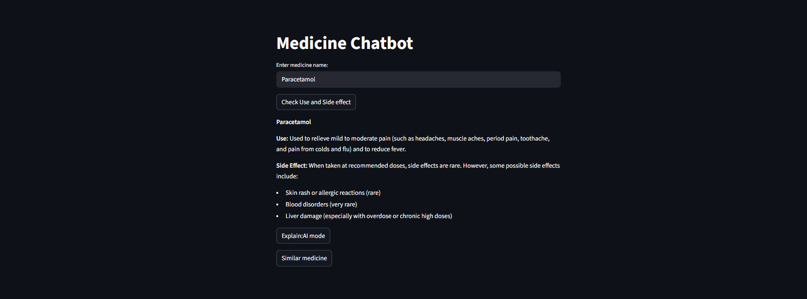
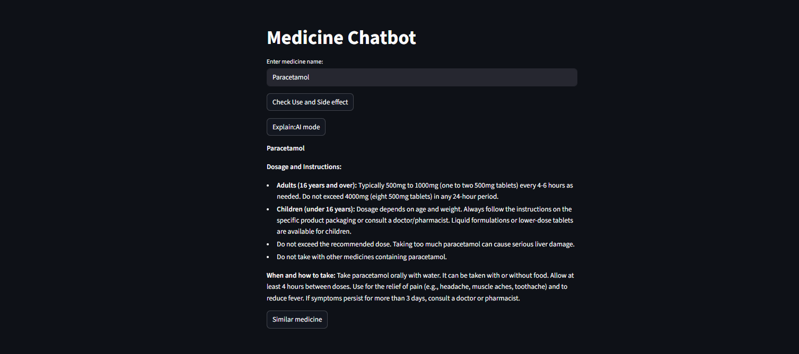
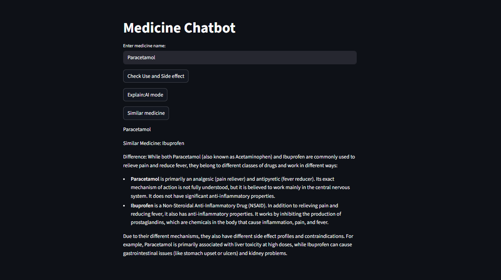
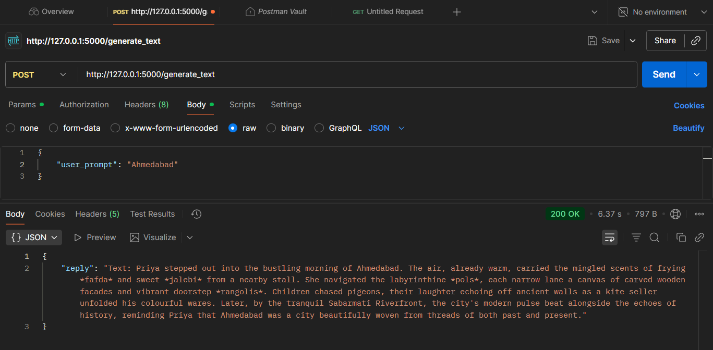
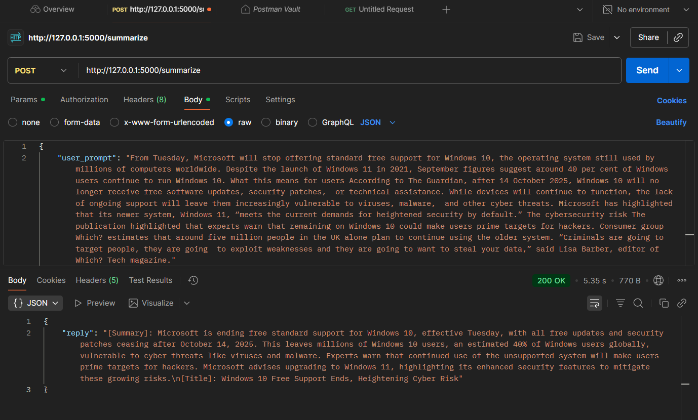
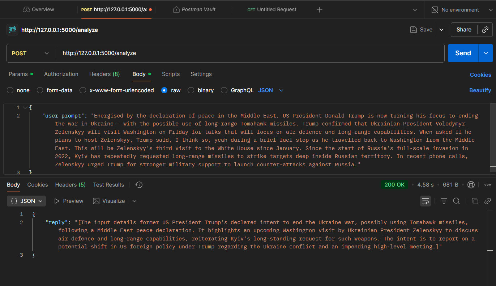

# Medicine Chatbot & Other AI Tasks

This is a medicine chatbot built using Flask, Streamlit and Gemini API.
It helps in educating people about medicines and also perform other AI tasks.

## Features 

* system_prompt: Prompt to generate the use and side effects of the medicine
* ai_explain_prompt: Promot to get a summarize details of the medicine
* similar_medicine: Prompt to get an alternative medicine details
* generate_text_prompt: Prompt to generate paragraph
* summarize_prompt:Prompt to summarize the paragraph
* analyze_prompt: Prompt to analyze

### Logging: 

To log each incoming request for tracking. All the files are stored 
in logs/app.log. Timestamp, Endpoint name and User prompt will be
returned.

## API endpoints

* /home GET: a welcome page
* /medicine_details POST: Use and side effect of medicine
* /ai_explain POST: Dosage, Instructions and timing
* /similar_medicine: similar medicine name, use and difference
* /generate_text: To generate a paragraph using a text input
* /summarize: To summarize the given article
* /analyze: To analyze and return the intent of the article

## Technologies used

* Flask
* Gemini API (gemini-2.5-flash)
* Streamlit

### 1. Medicine details:

### 2. AI explain mode:

### 3. Alternative:

### 4. Generate Text:

### 5. Summarize:

### 6. Analyze:

